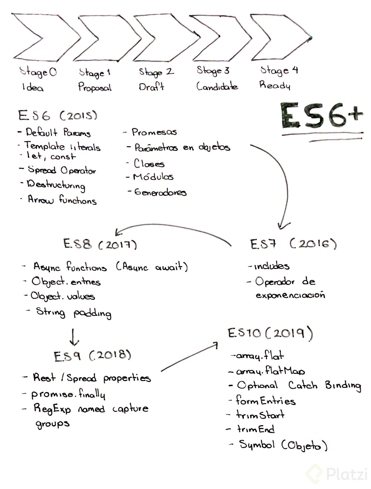

# ecma-script6-concepts
Basic Ecma Script 6 concepts for learn

## General info
Description new features es6, es7, es8, es9, es10

##src/es6 content
* Default parameters
* Literal template
* Var, Let, Const
* Spread
* Destructuring
* Arrow functions
* Promises
* Object parameters
* Modules
* Generator

##src/es7 content
* Array.includes()
* Operator exponent

##src/es8 content
* Object.entries()
* Object.values()
* padStart
* padEnd
* Async - Await

##src/es9 content
* Rest/Spread propierties
* Promise.finally
* RegExp named capture

##src/es10 content
* Array.flat
* Array.flatMap
* Optional catch binding
* Form entries
* TrimStart
* TrimEnd
* Symbol

## Image

## Contact
Created by [Johnatan Alexis Urbano Guzmán](https://www.johnatan.dev) - feel free to contact me!